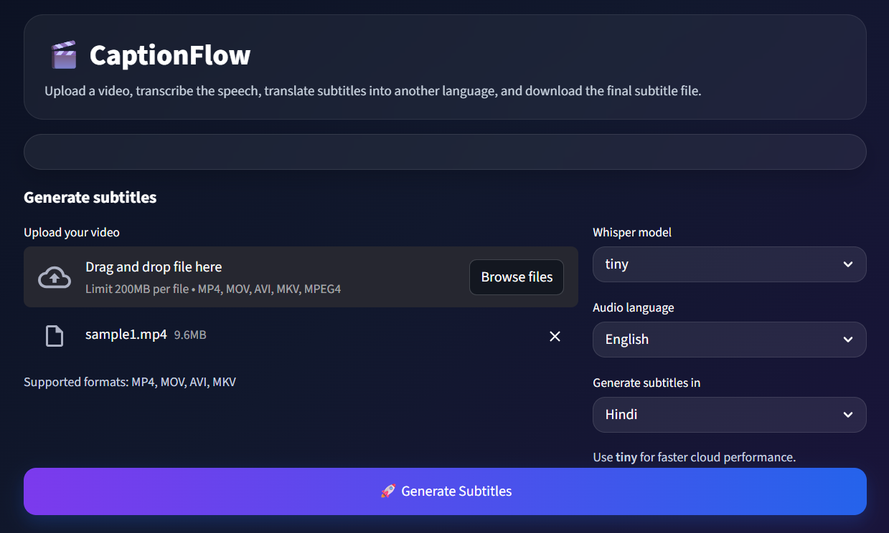

# 🎬 CaptionFlow – AI Video Subtitle Generator

CaptionFlow is an AI-powered Streamlit web application that generates subtitles from uploaded videos.

It can:
- extract audio from video
- transcribe speech into text
- generate timestamped `.srt` subtitle files
- provide plain transcript text for copy/download
- translate subtitles into other languages such as Hindi, Marathi, Spanish, and more

## 🚀 Live App
[Open CaptionFlow](https://rishiketpagi-captionflow.streamlit.app)

## 📂 GitHub Repository
[CaptionFlow Repository](https://github.com/rishiketpagi/captionflow)

---

## ✨ Features

- Upload video files (`.mp4`, `.mov`, `.avi`, `.mkv`)
- AI speech-to-text transcription using Faster-Whisper
- Subtitle generation in `.srt` format
- Plain transcript text output
- Download transcript as `.txt`
- Multilingual subtitle translation
- Modern website-like UI using Streamlit + custom CSS
- Browser-based usage with no local UI setup needed

---

## 🧠 Tech Stack

- Python
- Streamlit
- Faster-Whisper
- MoviePy
- ImageIO
- Deep Translator
- Custom CSS

---

## 📸 Screenshot

Add screenshot after uploading image to repo.

Example:



---

## ⚙️ Run Locally

Clone the repo

```bash
git clone https://github.com/rishiketpagi/captionflow.git
cd captionflow
```

Create virtual environment

```bash
python -m venv venv
venv\Scripts\activate
```

Install dependencies

```bash
pip install -r requirements.txt
```

Run app

```bash
streamlit run app.py
```

---

## ☁️ Deployment

This project is deployed using Streamlit Community Cloud.

Steps:

1. Push code to GitHub
2. Connect repo to Streamlit Cloud
3. Select app.py
4. Deploy

---

## 📌 Notes

* Use short videos for best performance
* Tiny model recommended for cloud
* Large videos may take longer

---

## ⭐ Future Improvements

* Subtitle translation
* Transcript download
* Editable subtitles
* Multiple languages
* Video summary
* Speaker detection

---

## 👨‍💻 Author
Rishiket Pagi

GitHub: https://github.com/rishiketpagi
LinkedIn: https://www.linkedin.com/in/rishiket-pagi
